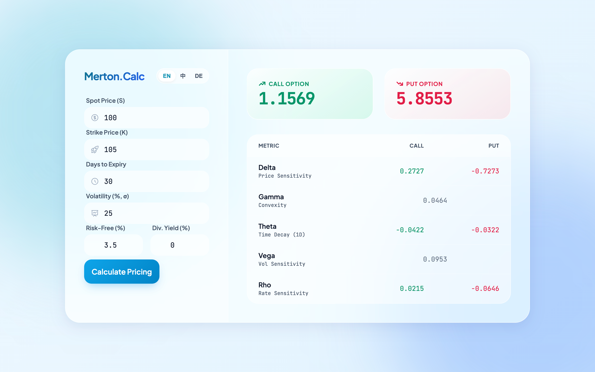

# 💎 Merton Option Calculator

A lightweight **Option Pricing Calculator** built entirely on **Cloudflare Workers**.

This project combines advanced financial mathematics (**Merton Model**) with a modern, aesthetic **Glassmorphism UI**. It runs on the edge, requires no origin server, and features a responsive design with real-time Greeks calculation.

## ✨ Features

- **⚡ Edge Computing**: Server-side rendered (SSR) directly from Cloudflare's global edge network for millisecond latency.
- **🧮 Advanced Math**: Implements the **Merton Model** (Black-Scholes extension) to account for continuous dividend yields ($q$).
- **📊 Real-time Greeks**: Instantly calculates risk metrics: Delta ($\Delta$), Gamma ($\Gamma$), Theta ($\Theta$), Vega ($\nu$), and Rho ($\rho$).
- **🌍 Internationalization (i18n)**: Built-in support for **English**, **Chinese (中文)**, and **German (Deutsch)**.
- **📱 Fully Responsive**: Optimized for desktop, tablets, and mobile devices.

## 📸 Screenshots



## 🚀 Quick Start

### Prerequisites

- [Node.js](https://nodejs.org/) installed.
- A [Cloudflare](https://www.cloudflare.com/) account.
- Wrangler CLI installed (`npm install -g wrangler`).

### 1. Installation

Clone the repository and navigate to the project folder:

```bash
git clone https://github.com/lingji-yidong/merton-option-calculator.git
cd merton-option-calculator
```

### 2. Local Development

Start a local development server to preview the app:

```bash
npx wrangler dev
```

Press `b` to open the browser. The worker handles both the HTML serving and the logic.

### 3. Deployment

Deploy to the Cloudflare Edge network with a single command:

```bash
npx wrangler deploy
```

## 📐 The Math

This calculator uses the **Merton Model**, which extends the standard Black-Scholes formula to include a continuous dividend yield ($q$).

The pricing formula for a Call Option ($C$) is:

$$C = S e^{-qT} N(d_1) - K e^{-rT} N(d_2)$$

Where:

$$d_1 = \frac{\ln(S/K) + (r - q + \sigma^2/2)T}{\sigma\sqrt{T}}$$

$$d_2 = d_1 - \sigma\sqrt{T}$$

**Variables:**

- $S$: Spot Price
- $K$: Strike Price
- $r$: Risk-free interest rate
- $q$: Dividend yield
- $\sigma$: Volatility
- $T$: Time to maturity
- $N(\cdot)$: Cumulative distribution function of the standard normal distribution

## 📂 Project Structure

```text
.
├── assets/
│   └── screenshot.png
├── src/
│   └── index.js       # Main Worker logic (HTML generation + Request handling)
├── wrangler.toml      # Cloudflare Workers configuration
├── README.md          # Documentation
└── LICENSE            # MIT License

```

## ⚠️ Disclaimer

**Not Financial Advice (NFA)**

This software is for **educational and informational purposes only**. The calculations provided by this tool are based on mathematical models (Merton/Black-Scholes) and theoretical assumptions which may not reflect real-world market conditions.

- **Do not** use this tool as the sole basis for making investment decisions.
- Option trading involves significant risk and is not suitable for every investor.
- The creators and contributors of this project assume **no responsibility** for any financial losses or damages resulting from the use of this software.

## 🤝 Contributing

Contributions, issues, and feature requests are welcome!
Feel free to check the [issues page](https://www.google.com/search?q=https://github.com/lingji-yidong/merton-option-calculator/issues).

## 📄 License

This project is licensed under the **MIT License**.
